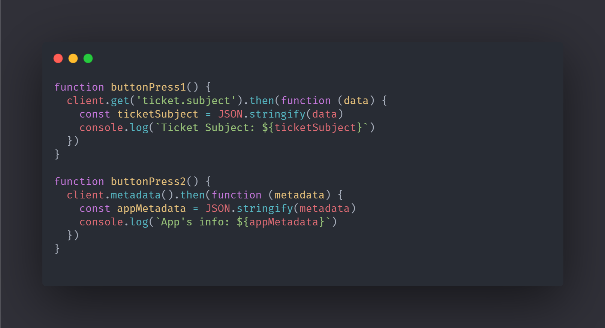
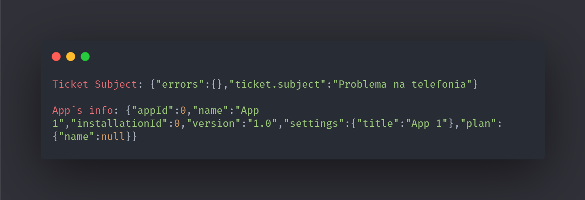

	<h1 align="center">Method GET App:tm:</h1>

  <a href="#-Technologies">Technologies</a>&nbsp;&nbsp;&nbsp;|&nbsp;&nbsp;&nbsp;
  <a href="#-Project">Project</a>&nbsp;&nbsp;&nbsp;|&nbsp;&nbsp;&nbsp;
  <a href="#-How-to-contribute">How to contribute</a>&nbsp;&nbsp;&nbsp;|&nbsp;&nbsp;&nbsp;
  <a href="#memo-license">License</a>

 

  

 

## :scroll: :arrow_right: :computer: Input

<h1 align="center">
    
</h1>

## :heavy_check_mark: :computer: :arrow_right: Result

<h1 align="center">
    
</h1>

## 🚀 Technologies

This project was developed with the following technologies:

- [ZAT](https://developer.zendesk.com/apps/docs/developer-guide/zat)
- [ZAF](https://developer.zendesk.com/apps/docs/developer-guide/using_sdk)
- [Javascript](https://www.javascript.com/)
- [HTML5](https://en.wikipedia.org/wiki/HTML5)
- [Zendesk Garden](https://garden.zendesk.com/)

## 💻 Project

The ***Method GET app***,  is a Project that **use the client.get method and client.metada** when click a button, it **GET** the Subject of the ticket or the metadata from the app. With the purpose of training ***ZAF***, using ***ZAT***, made with **ZAT**, **ZAF**, **Javascript**, **HTML5** and **Zendesk Garden**.

## 🤔 How to contribute

- Make a fork;
- Create a branch with your feature: `git checkout -b my-feature`;
- Do commit with your changes: `git commit -m 'feat: My new feature'`;
- Do a push for your branch: `git push origin my-feature`.

After the merge of your pull request was made, you can delete your branch.

## :memo: License

This project is under License MIT. See the documentation [LICENSE](LICENSE.md) for more details.

---

Developed by <a href="https://www.linkedin.com/in/leonardojesus02/">Leonardo Jesus</a> :copyright:
